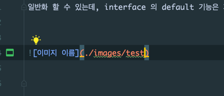

# 팩토리 메소드 (Factory method) 패턴
구체적으로 어떤 인스턴스를 만들지는 서브 클래스가 정한다.
이 패턴은 [OCP 원칙](https://ko.wikipedia.org/wiki/%EA%B0%9C%EB%B0%A9-%ED%8F%90%EC%87%84_%EC%9B%90%EC%B9%99) 이 main 철학이다.
OCP 원칙을 잘 지켰다면 기능을 추가하거나 변경해야 할 때 이미 제대로 동작하고 있던 원래 코드를 변경하지 않아도, 기존의 코드에 새로운 코드를 추가함으로써 기능의 추가나 변경이 가능해야한다.

조금 더 풀어서 설명하자면 product와 creator 간의 관계를 느슨하게(루즈 커플링) 가져가는 것이 핵심이다.
덕분에 기능의 확장이 있을때 기존 코드는 변경하지 않고(변경에는 닫혀있기 때문) 코드의 추가만 발생하는 것이다.

하지만 필수불가결하게 클래스의 수가 늘어나는 것은 피할 수 없다. 생성에 관한 모든 절차를 일반화해서 interface 로 정의하고 이를 상속하는 각각의 클래스가
각각의 특성화된 product을 만들도록 하는 것이 팩토리 메소드 패턴이기 때문에 Creator 가 각각의 클래스로 생성되게 된다.

+a 로 팩토리 메소드 패턴에서 interface 의 default 메소드와 private 메소드를 사용하면 abstract class 의 구현 없이 creator의 생성 행위를 더 간편하게
일반화 할 수 있는데, interface 의 default 기능은 자바 8 부터, interface 의 private 메소드는 자바 9부터 나온 기능임을 인지한다.

* simple factory 패턴 머릿속에 다 그릴 수 있도록 하기
* factory method 패턴 머릿속에 다 그릴 수 있도록 하기
* 동일한 예제를 simple factory 패턴으로도 구현하고 factory method 패턴으로도 구현하고 서로 비교해보기(백기선님 예제 보고 거기서 다룬 모든 것은 내가 만드는 예제에서 다 다루도록 만든다)

대원칙은 애매하게 아는 것이 아니라 모든 것이 구체적이고 명확해야한다는 것이다.

